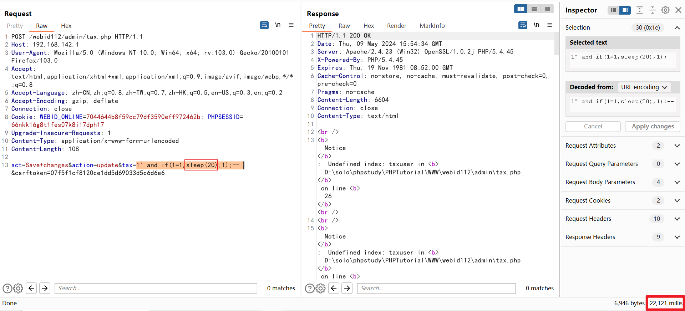
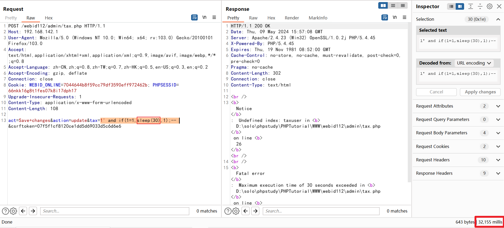

Exploit Title: WeBid v1.1.2 exists a SQL injection  vulnerability

Product: WeBid

Versio: v1.1.2

Software Link: https://webidsupport.4up.eu/   https://sourceforge.net/projects/simpleauction/


+ Vulnerability Description

  WeBid 1.1.2 admin/tax.php has a SQL injection  vulnerability,allowing remote attackers to execute SQL commands.

+ Testing procedure

  (1) Construct malicious SQL query statements in the request package,The following example executes the `sleep()` SQL function
  
  
  
  
  
+ Cause of vulnerability

  WeBid 1.1.2 admin/tax.php

  ```php
  23	if (isset($_POST['action']) && $_POST['action'] == 'update')
  24	{
  25		$query = "UPDATE " . $DBPrefix . "settings SET
  26					taxuser = '" . $_POST['taxuser'] . "',
  27					tax = '" . $_POST['tax'] . "'";
  28       $system->check_mysql(mysql_query($query), $query, __LINE__, __FILE__);
  29       $system->SETTINGS['taxuser'] = $_POST['taxuser'];
  30       $system->SETTINGS['tax'] = $_POST['tax'];
  31       $ERR = $MSG['1089'];
  32  }
  ```