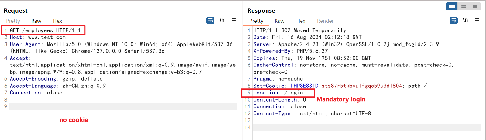
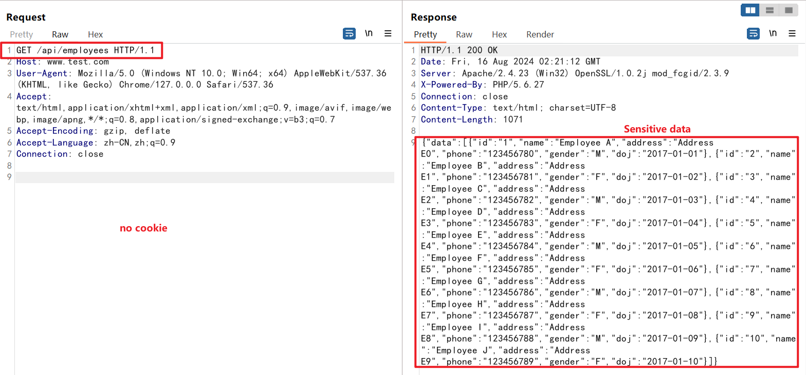

## 1 Vulnerability basic information

+ **Name of software:** stock-management-system
+ **Software Download:** https://github.com/haxxorsid/stock-management-system
+ **Affected version:** all version
+ **Types of vulnerabilities:** Improper Access Control (CWE-284)
+ **Vulnerability description and hazards:** haxxorsid/stock-management-system is an application developed based on MVC pattern, but the application only sets the permission control mechanism in the view layer, and does not set the permission control in the controller layer. As a result, unauthorized users can directly access controller's interface through apis to obtain sensitive application information or perform sensitive operations.
+ **Vulnerability contributor:** Qin Mai, Xinyi Wang of VARAS@IIE

## 2 Vulnerability recurrence

### 2.1 Access to sensitive information without login is normally blocked

### 2.2 Use the api mode to access

