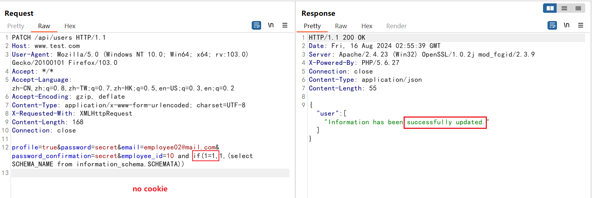
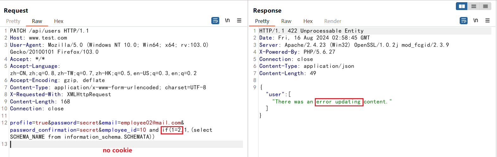
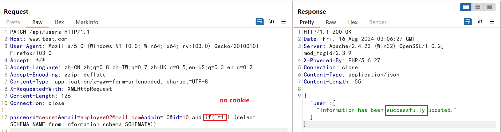
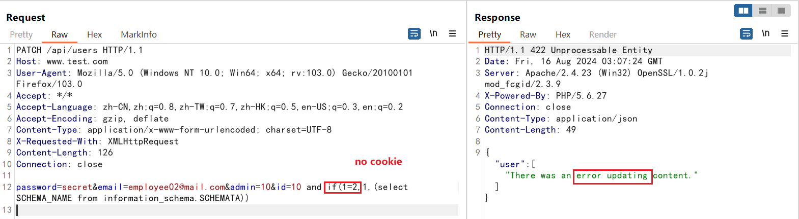
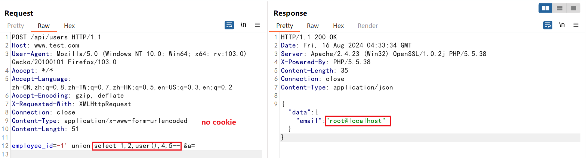
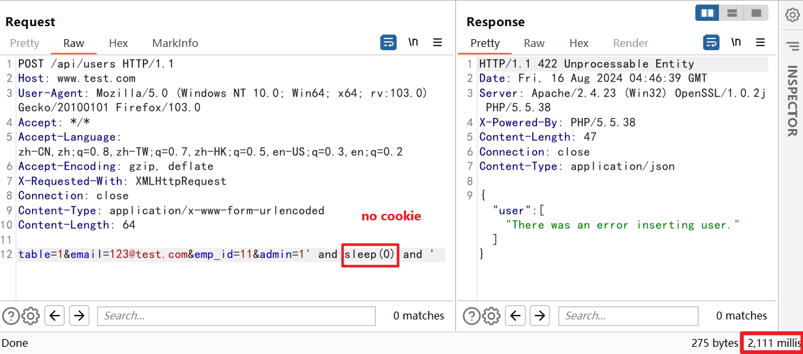
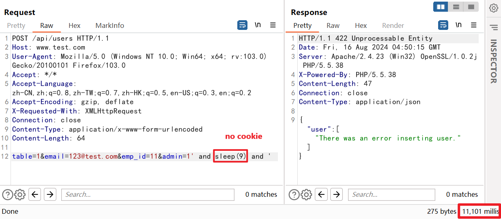
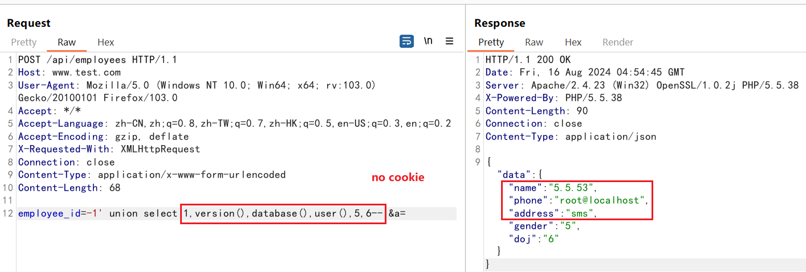

## 1 Vulnerability basic information

+ **Name of software:** stock-management-system
+ **Software Download:** https://github.com/haxxorsid/stock-management-system
+ **Affected version:** all version
+ **Types of vulnerabilities:** sql injection (CWE-89)
+ **Vulnerability description and hazards:** haxxorsid/stock-management-system uses string concatenation to construct SQL statements to query data, but does not filter all the variables involved in concatenation, resulting in unauthorized users can inject malicious SQL statements to query sensitive data or perform malicious database operations.
+ **Vulnerability contributor:** Qin Mai, Xinyi Wang of VARAS@IIE

## 2 Vulnerability recurrence

The application has 5 SQL injection vulnerabilities.

### 2.1 model/User.php:96 `employee_id` variable

### 2.2 model/User.php:84 `id` variable

### 2.3 model/User.php:69 `employee_id` variable

### 2.4 model/User.php:44 `admin` variable

### 2.5 model/Employee.php:46 `employee_id` variable
